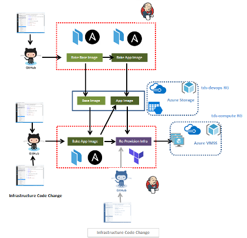

# Prototype Pipeline for Baking Custom Images

Baking and sharing custom layered machine images across separate infrastructure and application CI/CD pipelines  

## Pipelines

 * Bake Base Images (Infrastructure Pipeline)
 * Bake App Images (starting with Base images) and Deploy compute (Application Pipeline)

## Production Considerations

 * Blue-green deployments
 * Store terraform state in Azure / etcd
 * Separate out repos for infra and config management / provisioning code
 * Integrate two pipelines with branches for handling different deployment/provisioning state scenarios
 * Jenkins in master-agent mode with build agents in VMSS

